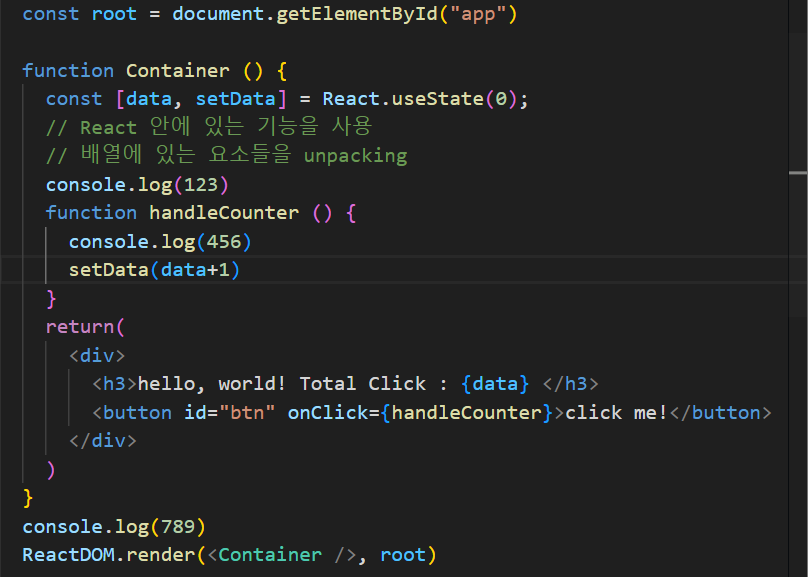
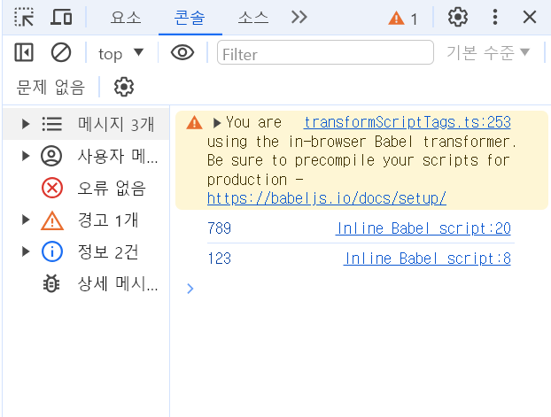

## 렌더링
- Vanilla JavaScript와 ReactJS는 노드 변경 처리 과정이 좀 많이 다릅니다.

1. Vanilla JavaScript
Vanilla JavaScript에서는 DOM 변경을 직접 처리합니다. 즉, 필요한 DOM 요소를 직접 선택하고, 요소의 속성을 변경하거나 새로운 요소를 추가하거나 기존 요소를 제거하는 등의 작업을 직접 수행합니다.
DOM 변경이 발생하면, 브라우저는 변경된 DOM 트리를 다시 계산하고, 렌더 트리를 다시 생성한 후 화면에 그립니다. 이 과정은 비용이 많이 드는 연산으로, 자주 발생하게 되면 성능을 저하시킬 수 있습니다.

2. ReactJS
ReactJS는 DOM 변경을 처리하기 위해 가상 DOM(Virtual DOM)이라는 개념을 도입합니다. ReactJS에서는 먼저 메모리에 가상 DOM 트리를 생성합니다. 이 트리는 실제 DOM 트리의 사본으로서, 실제 DOM 트리와 별도로 존재합니다.
ReactJS는 상태 변경이 발생할 때마다 새로운 가상 DOM 트리를 생성하고, 이전의 가상 DOM 트리와 비교하여 변경된 부분을 파악합니다. 이렇게 파악된 변경 사항만 실제 DOM에 반영하는 방식을 사용합니다. 이 과정을 '재조정(Reconciliation)' 또는 'Diffing'이라고 부릅니다.
가상 DOM을 사용함으로써, 변경이 필요한 최소한의 요소만 실제 DOM에 반영되기 때문에 불필요한 연산을 줄이고 성능을 향상시킬 수 있습니다.

따라서, ReactJS는 복잡한 UI 업데이트를 효과적으로 처리할 수 있으며, 이를 통해 웹의 응답성을 향상시키고 사용자 경험을 개선할 수 있습니다!

## Create Root
```jsx
const root = ReactDOM.createRoot(document.getElementById("root"));
```
## Rendering Stage

- 렌더링되는 순서를 주의하자!
- ```console.log()```를 통해 확인해보면 다음과 같다.


### 변수 재할당
const [value, modifier] = React.useState(0);
//중략
onClick={() => {modifier(value + 1);}}

const 변수는 재할당이나 갱신이 불가능한데도
위 코드가 작동할 수 있는 이유는 React.useState의 독특한 메커니즘 때문입니다.

일반적인 바닐라 js에서는
const a = 10
이라는 코드를 실행하면, 변수 a가 메모리에 할당되고 거기에 10이 저장되지, 10이라는 숫자가 독자적으로 별도의 메모리에 저장되지 않습니다.

반면,

리엑트에서
const [value, modifier] = React.useState(0);
위 코드는 value, modifier, 그리고 React.useState(0)까지
각자가 서로 다른 메모리에 할당됩니다.


onClick={() => {modifier(value + 1);}}
를 실행하면,
React.useState(0)가 위치한 메모리에서는 자신의 상태변수인 0을 1로 갱신합니다.
(이때, value가 있는 메모리에는 변화가 없습니다.)

이후, 재 렌더링이 일어나는데,
이때
const [value, modifier] = React.useState(0);
이 코드가 다시 실행되면서
새 value에 새로운 상태변수 1이 할당됩니다.

여기서 중요한 점은
최초에 페이지를 실행했을 때
value(=0)e는
클릭 후에 재 렌더링이 일어나며 할당된 value(=1)와는
서로 다른 메모리에 위치한 다른 변수라는 점입니다.
다른 말로 하면, 최초의 value는 재할당이나 갱신이
일어나지 않았고
동명에 다른 메모리에 위치한 value라는 새 변수가
만들어진 겁니다.

이 때문에, value가 constant 변수임에도
코드가 문제없이 실행되는 겁니다.
(chat GPT 참조)

## Why do I use 'useState' in a functional component?
- In React, useState is a Hook that allows you to add state to functional components. Before Hooks were introduced, only class components could have state. Hooks provide a way to use state and other React features without writing a class. Here are the reasons why useState is used in a functional component:

Simpler Syntax:

Functional components with Hooks are generally simpler and more concise compared to class components.
You can avoid the verbosity of class components and the complexity of this bindings.
State Management:

useState lets you manage state in a functional component. State is a way to store and manipulate data that can change over time.
It allows the component to remember values between renders and re-render when the state changes.
Encapsulation of Logic:

Hooks like useState encapsulate state-related logic inside the component, making it easier to understand and maintain.
Each call to useState creates a piece of state that is local to the component and doesn't affect other parts of the application.
Functional Paradigm:

Functional components and Hooks align with the functional programming paradigm, emphasizing the use of functions and immutability.
This can lead to more predictable and testable code.
Reusability:

Hooks enable the reuse of stateful logic between components. Custom Hooks can be created to share common stateful logic.
This promotes better code organization and reuse.

## The reason why we use the state update function instead of immediate value

setState와 useState는 비슷한 원리로 동작합니다. 두 경우 모두 상태 업데이트가 비동기적으로 일어나기 때문에, 바로 다음 줄에서 상태 값을 읽으면 예상과 다를 수 있습니다.

리액트에서 상태를 업데이트할 때는 여러 업데이트가 일괄 처리될 수 있고, 리렌더링 최적화를 위해 비동기적으로 처리될 수 있습니다. 이런 특성 때문에 상태 업데이트가 끝나기 전에 상태 값을 읽으면 업데이트가 반영되지 않은 값을 읽을 수 있습니다.

```jsx
import React, { useState } from 'react';

function Counter() {
  const [count, setCount] = useState(0);

  function handleClick() {
    setCount(count + 1);
    setCount(count + 1);
  }

  return (
    <div>
      <p>You clicked {count} times</p>
      <button onClick={handleClick}>
        Click me
      </button>
    </div>
  );
}

export default Counter;
```
-이 코드는 두 번의 setCount 호출이 순차적으로 처리되지 않고, 첫 번째 호출 후 상태 값이 바로 반영되지 않기 때문에 의도한 대로 동작하지 않을 수 있습니다. 이때는 상태 업데이트 함수를 사용하는 것이 더 안전합니다.
- 이전 상태값을 기준으로 상태를 업데이트하기
```jsx
function handleClick() {
  setCount(prevCount => prevCount + 1);
  setCount(prevCount => prevCount + 1);
}
```
- 이 코드에서는 상태 업데이트 함수 prevCount => prevCount + 1이 호출될 때마다 이전 상태 값을 기준으로 새 상태를 계산합니다. 이렇게 하면 여러 번 상태 업데이트를 호출해도 각각의 업데이트가 이전 상태 값을 정확하게 반영하게 됩니다.


### Is using the state update function a perfect solution for asynchronous updates?
- 
Using the state update function in React is not a perfect solution for handling all asynchronous issues, but it does help mitigate some common problems, especially those related to state consistency when updates depend on the previous state. Here’s a more detailed explanation:

## event listener
### the difference between onChange={onChange} and onChange={onChange()}
1. onChange={onChange}
- 핸들러 참조 전달: onChange={onChange}는 이벤트가 발생할 때 onChange 함수에 대한 ```참조```를 전달합니다. 이 방식은 이벤트가 발생할 때만 onChange 함수가 호출되도록 합니다.
2. onChange={onChange()}
- 함수 호출: onChange={onChange()}는 컴포넌트가 렌더링될 때 onChange 함수를 즉시 호출합니다. 그리고 그 함수의 반환값을 onChange prop으로 설정합니다.
잘못된 방식: 일반적으로 이벤트 핸들러는 함수 참조여야 합니다. 하지만 이 방식은 함수가 렌더링 시점에 호출되기 때문에, 이벤트가 발생할 때 핸들러로 설정된 함수가 동작하지 않습니다. 게다가 onChange 함수가 반환값이 함수가 아닌 경우, 오류가 발생할 수 있습니다.

3. parameter를 전달해야할 경우
- 이벤트 핸들러에 매개변수를 전달해야 하는 경우, 함수 참조를 직접 전달할 수 없으므로 래퍼 함수(wrapper function)를 사용해야 합니다. 이 경우 이벤트 핸들러가 특정 매개변수와 함께 호출될 수 있도록 합니다.

예를 들어, onChange 핸들러에 매개변수를 전달해야 한다면, 래퍼 함수를 사용하여 참조로 인식하게 할 수 있습니다. 이렇게 하면 함수가 즉시 호출되지 않고, 이벤트가 발생할 때 호출되도록 합니다.
```jsx
// 1) Event handler without parameters
const handleChange = (event) => {
  console.log(event.target.value);
};

<input type="text" onChange={handleChange} />;


// 2) Event handler with parameters 
const handleChange = (value, event) => {
  console.log(`Value: ${value}, Input: ${event.target.value}`);
};

<input
  type="text"
  onChange={(event) => handleChange('someValue', event)}
/>;

```
