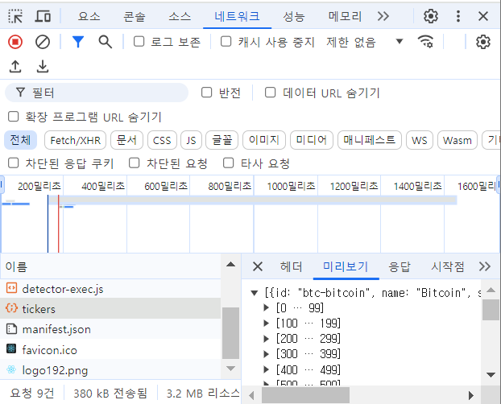
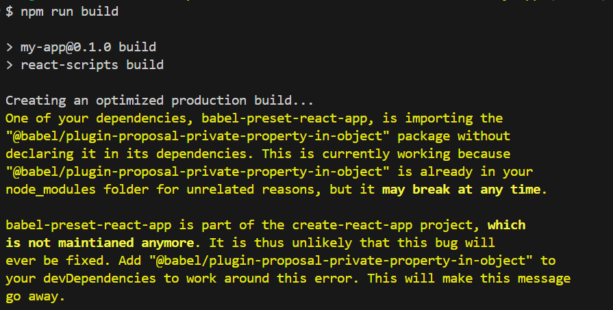
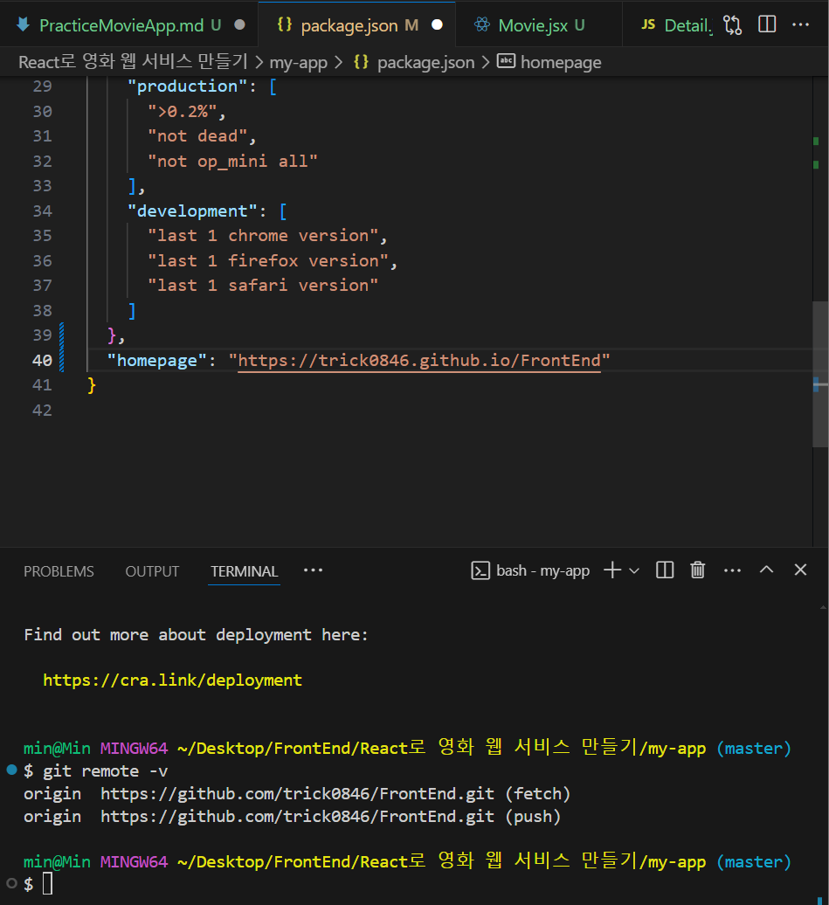
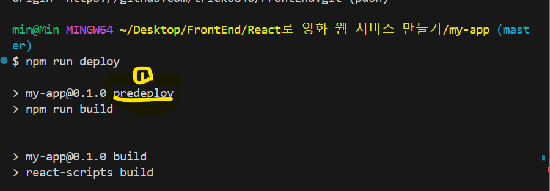

# PracticeMovieApp
## Create To Do List
### map
- ```Array.map()``` : Array에 있는 요소마다 map내의 Callback function에 대입해서 새로운 Array를 반환
```jsx
// 내가 작성한 코드
// todos에 있는 todo마다 각각 TodoListItem에 props로 넘겨준다.
<ul>
  {todos.map(todo => <TodoListItem todo={todo}/>)}
</ul>

// 
``` 

# Coin Tracker
## Create CoinTracker
### network
- 개발자도구에서 네트워크 확인해보면 tickers가 보인다.
```jsx
function CoinTracker() {
  const [loading, setLoading] = useState(true);
  useEffect(()=>{
    // fetch의 역할이 뭘까??
    fetch("https://api.coinpaprika.com/v1/tickers")
    // 이부분이 어떻게 이루어지는지....???
      .then((res) => response.json())
      .then((json) => console.log(json))
  },[]);


  return(
    <div>
      <h3>The Coins!</h3>
      {loading ? <h5>loading...</h5>:null}
      <ul>
        {coins.map((coin) => <li>{coin.name} ({coin.symbol}) : {coin.quotes.USD.price}</li>)}
      </ul>
    </div>
  )
}
```

- 미리보기에서 많은 response를 볼 수 있음

## Create Movie App
### 첫번째 방법(fecth)
```jsx
  const [loading, setLoading] = useState(true);
  const [movies, setMovies] = useState([]);

  useEffect(() => {
    fetch('https://yts.mx/api/v2/list_movies.json?minimum_rating=9&sort_by=year'      
    ).then((res) => res.json()
    ).then((json) => {
      setMovies(json.data.movies);
      setLoading(false);
    })
  },[])
  console.log(movies)
```
### 두번째 방법(async-await)
- 위의 코드에서 영화 제목이 화면에 렌더링되지 않는 이유는 movies.map 함수 안에 반환되는 JSX 요소가 없습니다. JSX 요소를 반환하려면 중괄호 대신 소괄호를 사용해야 합니다. (삼항연산자 부분에서!!)
```jsx
const getMovies = async() => {
    const response = await fetch(
      'https://yts.mx/api/v2/list_movies.json?minimum_rating=9&sort_by=year'
    );
    const json = await response.json();
    setMovies(json.data.movies);
    setLoading(false);
  };

  useEffect(() => {
    getMovies();
  },[]);

  console.log(movies);

  return(
    <div>
      <h3>Movie List</h3>
      <p>You can search {movies.length} movies</p>
      {loading ? (
        <strong>Loading...</strong>
      ) : (
        <div>
          {movies.map((movie) => (
            <div key={movie.id}>
              {movie.title}
            </div>
          ))}
        </div>
      )}
    </div>
  );
```

### optional Chainging
- 장르가 없는 경우에는 제외하고 표시해야하기 때문에 다음과 같이 처리
```jsx
<ul>
  {movie.genres?.map((genre) => (
    <li key={genre}>{genre}</li>
  ))}
</ul>
```

### 단축키!! 
- 문자열 일괄 변경 방법
1. 변경하고자 하는 문자열을 드래그합니다. VSCODE 파일
2. 드래그된 상태에서 Ctrl + Shift + L을 입력합니다. ...
3. 변경할 문자열로 수정하면 드래그된 문자열들이 일괄 변경 됩니다.

## React-DOM
- react-router-dom이 6버전이 나오면서 현재 이 강의에서 진행하는 것과 바뀐 부분이 있습니다. 다음 강의에서 react-router-dom을 5.3.0버전으로 설치합니다. 6버전으로 따로 진행하실 것이 아니라면 여기서 npm으로 설치하실 때 5.3.0버전으로 설치하시고 진행하시면 됩니다.  
```bash
npm i react-router-dom@5.3.0

// 최신버전 설치
npm i react-router-dom@latest
```
- 버전별 차이
```md
react-router-dom
npm i react-router-dom@5.3.0
https://v5.reactrouter.com/web/guides/quick-start

react-router-dom 5버전 -> 버전6 바뀐 부분

1. Switch컴포넌트가 Routes컴포넌트로 대체되었습니다.
Switch -> Routes

2. Route컴포넌트 사이에 자식 컴포넌트를 넣지 않고, element prop에 자식 컴포넌트를 할당하도록 바뀌었습니다.
Route path="/" element={< Home / >}

react-router-dom 6버전 문서
https://reactrouter.com/docs/en/v6/getting-started/overview
```

### Link
- Link를 사용해서 새로고침없이 링크로 이동

```jsx
import { Link } from 'react-router-dom'

<h5>
  <Link to="/movie">
    Title : {title}
  </Link>
</h5>
```

## Parameters
### Params in Route link
- link에 적게되는 변수명으로 useParams에 저장된다!
```jsx
// 1) Route를 지정한다.
<Route to="/movie/:id">
  <Detail/>
</Route>

// 2) 다른 컴포넌트에서 Route 호출경로 설정
// 경로 쓸때 주의할 점! 중괄호는 필수!!
<Link to={`movie/${movie.id}`}>
  {movie.title}
</Link>

// 3) 해당 경로와 연결된 컴포넌트에서 params를 받아서 사용할 수 있다.
// 이때의 key는 Route 설정시에 사용했던 key

import {useParams} from 'react-router-dom'

function Detail() {
  //useParams는 object 객체를 반환한다.
  const id = useParams().id
  console.log(id)

  return (
    <h1>Detail</h1>
  )
}
```
## Publishing
### github에 배포하기
- 결과물을 github pages에 업로드 할 수 있게 해주는 패키지
1. gh-pages 설치하기
```bash
npm i gh-pages
```
- 참고  
```jsx
Route path={`${process.env.PUBLIC_URL}/`} element={< Home />}
```
2. package.json에 있는 scripts 확인하기
```json
  "scripts": {
    "start": "react-scripts start",
    "build": "react-scripts build",
    // production ready code(압축되고 최적화된) 생성
    "test": "react-scripts test",
    "eject": "react-scripts eject"
  },
```
- build 실행
```bash
npm run build
```

- react에 build 폴더가 생성
3. Github에 push

- 마지막 부분에 다음 코드를 추가하기
```json
[
  {
  },
  // 이부분을 추가해야한다!!
  // repo 이름은 git remote -v로 확인 가능!!
  // "homepage": "https://<your-username>.github.io/<your-repo-name>",

  {
    "homepage": "https://trick0846.github.io/FrontEnd"
  }
]
```
- scripts에 다음 부분 추가하기  
deploy : 우리가 설치한 gh-pages를 실행시키고 build라는 directory를 가져가기
- 이 과정은 command를 생성하는 과정이다!!
```json
[
  "scripts": {
    "start": "react-scripts start",
    "build": "react-scripts build",
    "test": "react-scripts test",
    "eject": "react-scripts eject",
    "deploy": "gh-pages -d build",
    // build 후에 deploy하는 과정을 단축하고 싶다면 다음 코드 사용
    // 이렇게 하면 deploy를 실행하면 Node.js가 predeploy를 먼저 실행
    "predeploy" : "npm run build"
  },
]
```
- 위의 코드를 실행하면 아래와 같이 진행

- 


