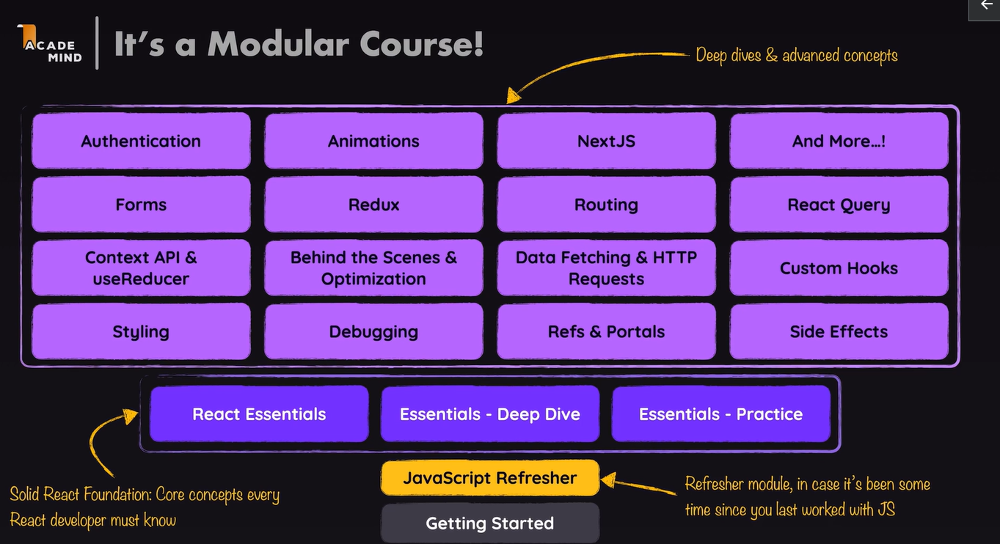
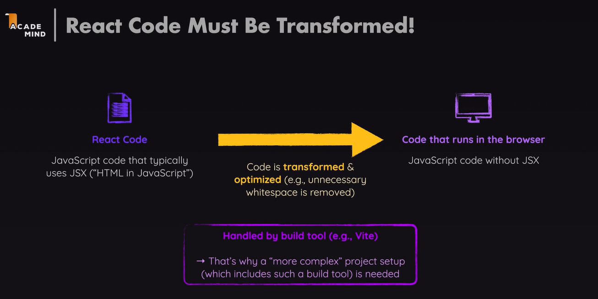

# Introduction
## 1. What is React?
- A JavaScript library for building user interface
- 자바스크립트로만 작업하는건 바람직하지 않다.
- It quickly becomes cumbersome, error-prone and hard to maintaion or edit in more complex user interface
=> So React offers a way simpler "mental mode"
- ```react.new```, ```JS.new```를 입력하면 로컬 시스템없이 웹에서 간단한 개발 가능하다!
- jsx : js + XML
- 예시 코드
```jsx
import { useState } from "react";

// 스타일을 세부적으로 적용하고 싶다면 다음과 같이 컴포넌트에 맞는 style.css 파일을 생성한 후에 이 코드에 작성하자!
// 그러면 hover 등의 효과도 적용할 수 있다!!
import "./styles.css";

const content = [
  [
    "React is extremely popular",
    "It makes building complex, interactive UIs a breeze",
    "It's powerful & flexible",
    "It has a very active and versatile ecosystem"
  ],
  [
    "Components, JSX & Props",
    "State",
    "Hooks (e.g., useEffect())",
    "Dynamic rendering"
  ],
  [
    "Official web page (react.dev)",
    "Next.js (Fullstack framework)",
    "React Native (build native mobile apps with React)"
  ]
];

export default function App() {
  const [activeContentIndex, setActiveContentIndex] = useState(0);
  // activeContentIndex의 초기값은 0

  return (
    <div>
      <header>
        
        <div>
          <h1>React.js</h1>
          <p>i.e., using the React library for rendering the UI</p>
        </div>
      </header>

      <div id="tabs">
        <menu>
          <button
            className={activeContentIndex === 0 ? "active" : ""}
            onClick={() => setActiveContentIndex(0)}
          >
            Why React?
          </button>
          <button
            className={activeContentIndex === 1 ? "active" : ""}
            onClick={() => setActiveContentIndex(1)}
          >
            Core Features
          </button>
          <button
            className={activeContentIndex === 2 ? "active" : ""}
            onClick={() => setActiveContentIndex(2)}
          >
            Related Resources
          </button>
        </menu>

        {/* 이 부분이 위의 코드에 영향을 받아서 내용이 바뀌는 부분! */}
        <div id="tab-content">
          <ul>
            {content[activeContentIndex].map((item) => (
              <li key={item}>{item}</li>
            ))}
          </ul>
        </div>
      </div>
    </div>
  );
}
```
## JS VS React
### React = Declarative UI Programming
- JS 는 Imperative : Define the steps, not the goal
- React는 Declarative : Define the goal, not the steps
- With React, you define the target UI state(s) - not the steps to get there  
Instead, React will figure out & perform the necessary steps
- 리액트는 값이 변할 때마다 스스로 변화가 필요한 부분만 rerendering  
리액트가 알아서 과정을 파악해 실행 => 선언형으로 작성하기

## Course
### Specific info 

1. JavaScript Refresher(자바스크립트 새로고침)
2. Solid React Foundation(섹션 3,4,5)
3. Deep dives & advanced concepts
### How to get the most out of this course
1. Meet the prerequisites
- Basic web dev & JavaScript knowledge is required.  
Use the JavaScript refresher if needed
2. Watch the videos
- Watch them at your pace  
Slow me down or speed me up  
Pause & rewind
- Repeat sections  
: Feel free to repeat retire sections. This is a normal part of learning something.
3. Practice
- Complete coding exercises
- Pause & practice on your own
- Building dummy demo projects
4. Help each other
- Use code attachments if stuck
- Ask & answer in the Q&A section
- Find fellow developers on our Discord
```md
온라인 학습 커뮤니티 참여하세요

수강생 여러분, 환영합니다!

강의를 수강하시면 Discord에 있는 “Academind Community”도 무료로 이용하실 수 있습니다. (https://academind.com/community/)

Discord 커뮤니티에서 비슷한 관심사를 가진 사람들을 만나 토론하고 서로 돕고, 진행 상황과 성공담, 아이디어를 공유하며 즐거운 시간을 보내세요!

저는 혼자 공부하는 것보다 스터디 그룹을 찾거나 비슷한 관심사를 가진 사람들과 함께 공부하는 게 가장 효율적인 학습법이라고 생각합니다. “Academind Community”가 이러한 만남의 장이 되어 본 강의의 훌륭한 보충 자료의 역할을 해줄 겁니다.

커뮤니티 가입은 무료이며, 100% 선택 사항입니다!

커뮤니티에 많은 참여 부탁드립니다! :-)


수강 중 막히는 부분이 있다면 제 코드 스냅샷을 사용하여 여러분의 코드와 제 코드를 비교해 보세요: https://github.com/academind/react-complete-guide-course-resources
```

## Create React Projects
### (1) CodeSandbox
- ```react.new```를 입력해 브라우저 내에서 개발하기
- 별도의 프로그램 설치 없이 preview를 확인하며 개발할 수 있다.
### (2) Local React Project
- Need to install NodeJS
- 이 수업에서 NodeJS 코드를 작성하지는 않지만, Vite와 같은 로컬 리액트 프로젝트를 생성하는 여러가지 도구는 NodeJS를 사용한다.
```bash
// react-project는 프로젝트의 이름 => You need to select a framework and a variant.
npm create vite@latest react-project 
```
- 로컬 작업물에서 주의할 것은 작업물을 완료할 때 리액트 라이브러리 패키지와 같은 작업물에 사용된 추가 패키지를 설치하기 위해 ```npm install```을 실행해야 한다.
- In case of Vite projects, You need to run ```npm install``` once, initially, after creating a new project  
-> This command downloads required packages.
- ```npm run dev``` starts a development preview server that allows you to view the web app you're working on.
- ```npm start```과의 차이점 정리해보기

### Why is separate project setup required to use React?
- Configuration: React projects often require custom configurations to optimize performance, enable features like hot reloading, or support JSX syntax. Setting up a separate project allows developers to tailor these configurations according to their specific needs.



