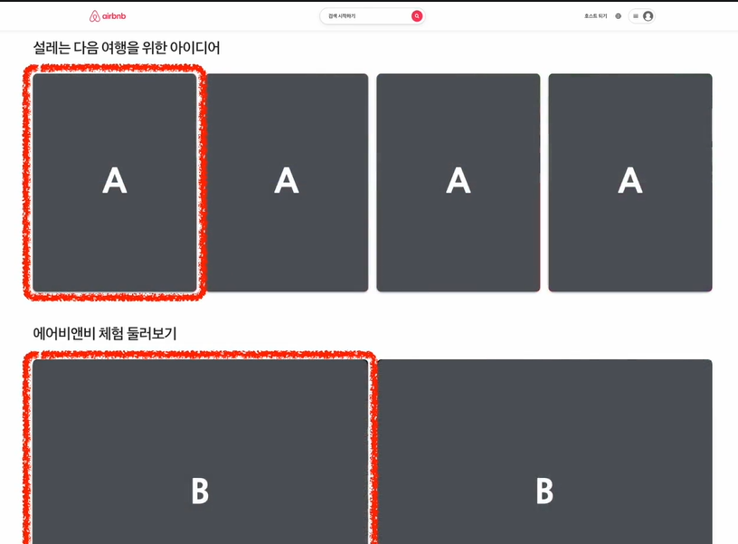
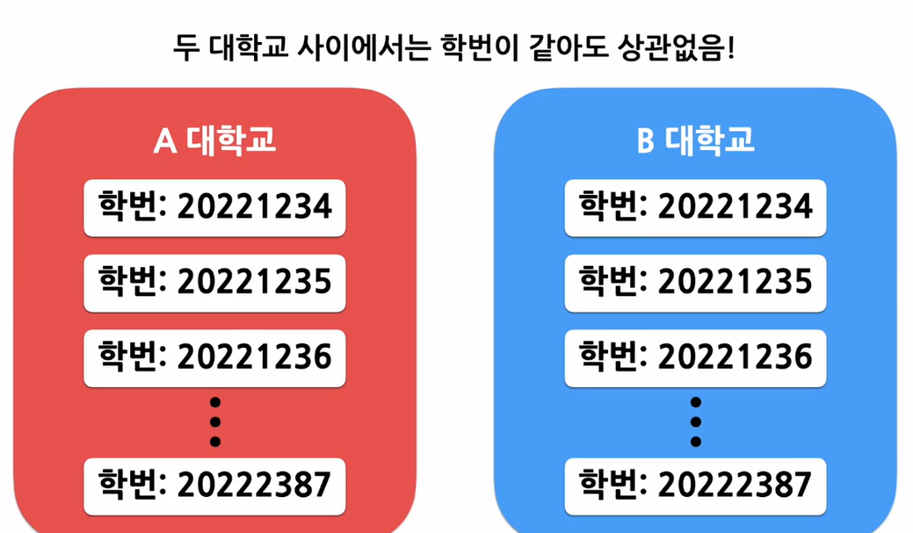

# List & Keys
## 1. 정의
### (1) List
- array
### (2) Keys
- 열쇠 = 고유한 값 / 각 객체나 아이템을 구별하기 위한 고유한 문자열

## 2. 여러개의 Component 렌더링하기
### 개념

- A, B 컴포넌트가 반복적으로 화면에 렌더링
- 동일한 컴포넌트에 데이터만 달라지는 것이므로, 여러번 쓰는것은 비효율적이므로  
```map()```을 사용해서 코드의 반복 진행
```jsx

// 예제 1
const doubled = numbers.map((number) => number * 2);

// 예제 2
const numbers = [1,2,3,4,5];
const listItems = numbers.map((number) =>
  <li>{number}</li>
);

ReactDOM.render(
  <ul>{listItems}</ul>,
  document.getElementById('root')
);
```
## 3. 기본적인 List Component
### 예제 1 : 숫자목록 출력하기 numberList
```jsx

// 컴포넌트(함수처럼 생각해보자)를 정의
function NumberList(props) {
  const { numbers } = props;

  const listItems = numbers.map((number) =>
    <li>숫자는 {number}</li>
  );

  return (
    <ul>{listItems}</ul>
  );
}

// 실질적으로 렌더링하고싶은 변수 선언
const numbers = [1,2,3,4,5,6]

ReactDOM.render(
  <NumberList numbers={numbers} />,
  // 이러면 props.numbers는 위에 선언한 numbers가 된다.
  document.getElementById('root')
);
```

## List의 Key
### 경고 : Each child in a list should have a unique "key" prop.
### (1) List의 Key
- Key의 값은 같은 List에 있는 Elements 사이에서만 고유한 값이면 된다.

---
### key 사용 예제
- 예제 1. key로 값을 사용하는 경우
```jsx
const numbers = [1,2,3,4,5];
const listItems = numbers.map((number) =>
  // 값을 key로 사용 => 중복된 값이 있는 경우 경고 메시지 출력
  <li key={number.toString()}>
    {number}
  </li>
);
```
- 예제 2. key로 Id를 사용하는 경우
```jsx
const todoItems = todos.map((todo) => 
  <li key={todo.id}>
    {todo.text}
  </li>
);
```
- 예제 3. key로 index를 사용하는 경우  
배열이 변경될 수 있는 경우에는 권장 X  
```리액트에서는 키를 명시적으로 넣어주지 않으면 기본적으로 이 인덱스 값을 키값으로 사용```
```jsx
const todoItems = todos.map((todo, index) => 
  // index라고 따로 변수명을 지정했기때문에 여기에서 todo.index로 적으면 X!!
  <li key={index}>
    {todo.text}
  </li>
);
```
## 실습
