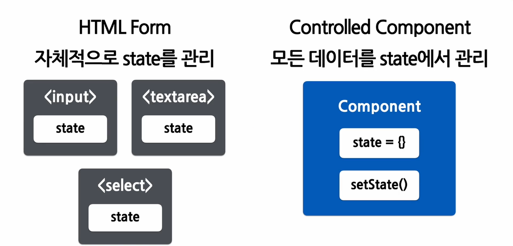

# 11 Forms
## 1. Form
### Form
- 양식, 사용자로부터 입력을 받기 위해 사용
- JavaScript에서 제어가 편하도록 Controlled Component를 사용

### Controlled Form

- 값이 리액트의 통제를 받는 Input Form Element
- HTML Form에서는 각 엘리먼트가 자체적으로 state를 관리한다.
- Controlled Component에서는 모든 데이터를 state에서 관리한다.
```jsx
function NameForm(props) {
  const [value, setValue] = useState('') // 초기값은 빈 값으로 설정

  // 값이 바뀔때마다(onchange) 갱신한다.
  const handleChange = (event) => {
    setValue(event.target.value);
  }
  

  const handleSubmit = (event) => {
    alert('입력한 이름: ' + value);
    event.preventDefault(); // 제출하면 새로고침이 되는 것을 막기위해서!
  }

  return (
    <form onSubmit={handleSubmit}>
      <label>
        이름 : 
        <input type="text" value={value} onchange={handleChange} />
        {/* input Element는 여닫는 게 하나로 해결되므로 뒤에 / 붙이기! */}
      </label>
      <button type="submit">제출</button>
    </form>
  )
}
```
- 추가적인 함수 : 모든 입력값을 대문자로 변경(toUpperCase)
```jsx
const handleChange = (event) => {
  setValue(event.target.value.toUpperCase());
}
```
## 2. 다양한 Forms
### (1) Textare 태그
- 여러 줄에 걸쳐 긴 텍스트를 입력받기 위한 HTML 태그
```html
<textarea>
  안녕하세요, 여기에 이렇게 텍스트가 들어가게 됩니다.
</textarea>
```
- React에서는 state로 관리한다  
예제 : requestForm(고객의 요청사항 받기)
```jsx
function RequestForm(props) {
  const [value, setValue] = useState('요청사항을 입력하세요.')

  const handleChange = (event) => {
    setValue(event.target.Value)
  }

  const handleSubmit = (event) => {
    alert('입력한 요청사항 :' + value);
    event.preventDefault();
  }


  // 반환할 컴포넌트의 형태
  return (
    <form onSubmit={handleSubmit}>
      {/* ladel element 안에 작성하기 */}
      <label>
        요청사항
        <textarea value={value} onChange={handleChange} />
      </label>
      <button>제출하기</button>
    </form>
  )
}
```
### (2) select
- Drop-down 목록을 보여주기 위한 HTML 태그
- 여러가지 옵션 중에서 하나를 서택할 수 있는 기능을 제공합니다.
- option 태그를 select 태그가 감싸는 형태로 사용한다.
- 예시 : react에서의 select 태그
```jsx
// (1) 기본 select 태그
<select>
  <option value="apple">사과</option>
  <option value="banana">바나나</option>
  <option selected value="grape">포도</option>
  {/* 현재 선택된 option에는 selected value */}
  <option value="watermelon">수박</option>
</select>


// (2) react에서 select 사용
const [value, setValue] = useState('grape') // 기본값을 state를 선언할 때 지정

const handleChange = (event) => {
  setValue(event.target.Value) // value가 아닌 Value
}

const handleSubmit = (event) => {
  alert("선택한 과일 : " + value);
  event.preventDefault();
}
<form onSubmit={handleSubmit}>
  <label>
    과일을 선택하세요 : 
  <select value={value} onChange={handleChange}>
    <option value="apple">사과</option>
    <option value="banana">바나나</option>
    <option value="grape">포도</option>
    <option value="watermelon">수박</option>
  </select>
  </label>
  <button type="submit">제출</button>
</form>
```
- 여러 개의 옵션 선택 가능!
```jsx
<select mulitple={true} value={['B','C']}></select>
```
### 정리
- 모두 ```value```라는 attribute를 통해서 값을 전달하고, 값을 변경할때는 onChange에서 setValue 함수를 사용하여 값을 업데이트합니다.
## 3. File Input
### File Input
- 디바이스의 저장 장치로부터 하나 또는 여러 개의 파일을 선택할 수 있게 해주는 HTML 태그
- 읽기 전용으로, uncontrolled Component( 값이 React의 통제를 받지 않는다.)
```jsx
// input 태그에 / 넣는거 까먹지 말자!!
<input type="file" />
```

## 4. Multiple Inputs
- 여러 개의 state를 선언하여 각각의 입력에 대해 사용한다.
- 호텔 예약 서비스 : reservation service
```jsx
function Reservation(props) {
    const [haveBreakfast, setHaveBreakfast] = useState(true);
    const [numberOfGuest, setNumberOfGuest] = useState(2);

    const handleSubmit = (event) => {
        alert(`아침식사 여부: ${haveBreakfast}, 방문객 수: ${numberOfGuest}`);
        event.preventDefault();
    }

    return (
        <form onSubmit={handleSubmit}>
            <label>
                아침식사 여부:
                <input
                    type="checkbox" 
                    checked={haveBreakfast}
                    onChange={(event) => {
                        setHaveBreakfast(event.target.checked);
                    }} />
                    {/* checked의 값이 true or false */}
            </label>
            <br />
            <label>
                방문객 수:
                <input
                    type="number"
                    value={numberOfGuest}
                    onChange={(event) => {
                        setNumberOfGuest(event.target.value);
                    }} />
            </label>
            <button type="submit">제출</button>
        </form>
    );
}
```

## 5. Input Null Value
### Input Null Value
- 만약 value prop은 넣되 자유롭게 입력할 수 있게 만들고 싶다면 값에  
```undefined``` 또는 ```null```을 설정하면 된다.
```jsx
ReactDOM.reander(<input value="hi" />, rootNode);

setTimeout(function() {
  ReactDOM.render(<input value={null} />, rootNode)
},1000)
```
## 실습
