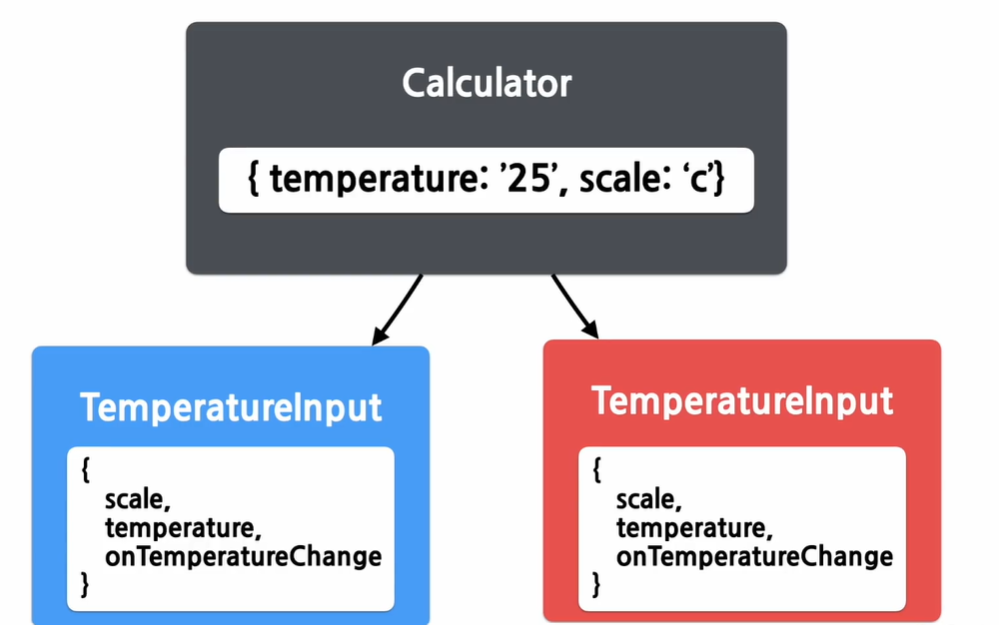

# Lifting State Up
## 1. Shared State
### Shared State
- 자식 컴포넌트가 가장 가까운 공통된 부모 컴포넌트의 스테이트를 공유해서 사용
## 2. 하위 컴포넌트에서 State 공유하기
### 예제
```jsx

// 부모 컴포넌트
import React, { useState } from 'react';

function Calculator(props) {
  const [temperature, setTemperature] = useState('');

  const handleChange = (event) => {
    setTemperature(event.target.value);
  };

  return (
    <fieldset>
      <legend>섭씨 온도를 입력하세요:</legend>
      <input
        value={temperature}
        onChange={handleChange}
      />
      <BoilingVerdict
        celsius={parseFloat(temperature)}
      />
    </fieldset>
  );
}

function BoilingVerdict({ celsius }) {
  if (celsius >= 100) {
    return <p>The water would boil.</p>;
  }
  return <p>The water would not boil.</p>;
}

export default Calculator;


// 자식 컴포넌트
function BoilingVerdict(props) {
  if (props.celsius >= 100) {
    return <p>물이 끓습니다</p>;
  }
  return <p>물이 끓지 않습니다</p>;
}

export default BoilingVerdict;
```


## 3. Lifting State Up
### Lifting State Up
- 하위 컴포넌트의 state를 공통 상위 컴포넌트로 올린다.
- TemperatureInput(하위 컴포넌트)
```jsx
import React from 'react';

const scaleNames = {
  c: '섭씨',
  f: '화씨'
};

function TemperatureInput(props) {
  const handleChange = (event) => {
    props.onTemperatureChange(event.target.value);
  };

  return (
    <fieldset>
      <legend>
        온도를 입력해 주세요(단위: {scaleNames[props.scale]}):
      </legend>
      <input value={props.temperature} onChange={handleChange} />
    </fieldset>
  );
}

export default TemperatureInput;
```
- Calculator(상위 컴포넌트)
```jsx
import React, { useState } from 'react';

function Calculator(props) {
  // 1) state로 Temperature와 Scale을 선언하여 온도값과 단위를 저장
  const [temperature, setTemperature] = useState('');
  const [scale, setScale] = useState('c');


  const handleCelsiusChange = (temperature) => {
    setTemperature(temperature);
    setScale('c');
  };

  const handleFahrenheitChange = (temperature) => {
    setTemperature(temperature);
    setScale('f');
  };

  const celsius = scale === 'f' ? tryConvert(temperature, toCelsius) : temperature;
  const fahrenheit = scale === 'c' ? tryConvert(temperature, toFahrenheit) : temperature;

  return (
    <div>
      <TemperatureInput
        scale="c"
        temperature={celsius}
        // 사실상 vue에서 사용하는 emit과 유사하다!
        // 실제로 state를 가지고 있는 곳에서 함수를 선언하고, 이를 전달해서 밑에서 사용하는 것!
        onTemperatureChange={handleCelsiusChange}
      />
      <TemperatureInput
        scale="f"
        temperature={fahrenheit}
        onTemperatureChange={handleFahrenheitChange}
      />
      <BoilingVerdict
        celsius={parseFloat(celsius)}
      />
    </div>
  );
}

function toCelsius(fahrenheit) {
  return ((fahrenheit - 32) * 5) / 9;
}

function toFahrenheit(celsius) {
  return (celsius * 9) / 5 + 32;
}

function tryConvert(temperature, convert) {
  const input = parseFloat(temperature);
  if (Number.isNaN(input)) {
    return '';
  }
  const output = convert(input);
  const rounded = Math.round(output * 1000) / 1000;
  return rounded.toString();
}

function BoilingVerdict({ celsius }) {
  if (celsius >= 100) {
    return <p>The water would boil.</p>;
  }
  return <p>The water would not boil.</p>;
}

export default Calculator;
```
### 정리


## 실습


