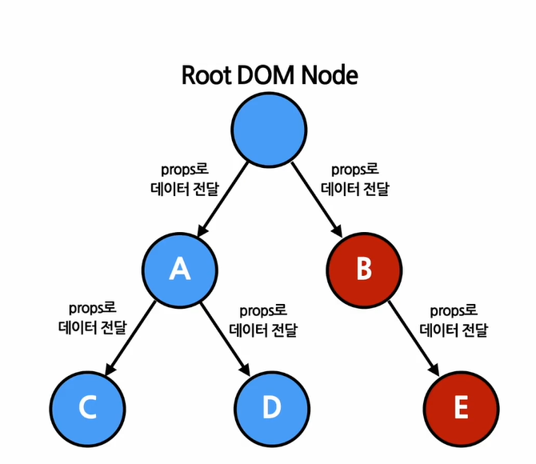
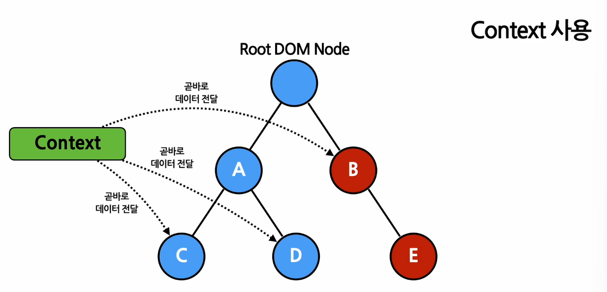

# Context
## 1. Context
### Context 
- 컴포넌트의 props를 통한 데이터 전달 but 코드의 복잡도 증가  
=> ```컴포넌트 트리```를 통해 곧바로 컴포넌트로 전달하는 새로운 방식 제공
- 기존의 방식  
여러 단계에 걸쳐서 하위 노드에 데이터 전달시에 코드도 그만큼 복잡해진다.

- Context : Vue.js의 Pinia와 유사

### Context의 사용
- 로그인 여부, 로그인 정보, UI 테마, 현재 언어 등  
여러 컴포넌트에서 필요로 하는 것
- (1) 기존 방식
```jsx

// Root Node
function App(props) {
  return <Toolbar theme="dart" />;
}

// 하위 노드
function Toolbar(props) {
  return (
    <div>
      <ThemedButton theme={props.theme} /> 
        {/* theme props를 무조건 가지고있어야한다. */}
    </div>
  );
}

// 하위 노드
function ThemedButton(props) {
  return <Button theme={props.theme} />;
}

// => 총 두번 props로 전달
```
- (2) Context 사용  
Context 선언 => context.Provider / value="---" => 사용할 곳에서 context.Consumer

```jsx
// 컨텍스트는 데이터를 매번 컴포넌트를 통해 전달할 필요 없이 컴포넌트 트리로 곧바로 전달하게 해줍니다.
// 여기에서는 현재 테마 값을 위한 컨텍스트를 생성하며, 기본값은 'light'입니다.
const ThemeContext = React.createContext('light');

// Provider를 사용하여 하위 컴포넌트들에게 현재 테마 데이터를 전달합니다.
// 모든 하위 컴포넌트들은 컴포넌트 트리 하단에 얼마나 깊이 있는지에 관계없이 데이터를 읽을 수 있습니다.
// 여기에서는 현재 테마값으로 'dark'를 전달하고 있습니다.
function App(props) {
  return (
    <ThemeContext.Provider value="dark">
      <Toolbar />
    </ThemeContext.Provider>
  );
}

// 이제 중간에 위치한 컴포넌트는 테마 데이터를 하위 컴포넌트로 전달할 필요가 없습니다.
function Toolbar(props) {
  return (
    <div>
      <ThemedButton />
    </div>
  );
}

function ThemedButton(props) {
  // 리액트는 트리 구조상 가장 가까운 상위 Provider를 찾아서 해당되는 값을 사용합니다.
  // 만약 해당하는 Provider가 없을 경우 기본값(여기에서는 'light')을 사용합니다.
  // 여기에서는 상위 Provider가 있기 때문에 현재 테마의 값은 'dark'가 됩니다.
  return (
    <ThemeContext.Consumer>
      {value => <button theme={value} />}
    </ThemeContext.Consumer>
  );
}
```
### 주의사항
- Context 사용시 컴포넌트의 재사용성이 낮아진다
- 하위 컴포넌트를 여러 개의 변수로 나눠서 전달
```jsx
// 1) props를 하위 컴포넌트에 계속 전달하기


// Page 컴포넌트는 PageLayout 컴포넌트를 렌더링
<Page user={user} avatarSize={avatarSize} />

// PageLayout 컴포넌트는 NavigationBar 컴포넌트를 렌더링
<PageLayout user={user} avatarSize={avatarSize} />

// NavigationBar 컴포넌트는 Link 컴포넌트를 렌더링
<NavigationBar user={user} avatarSize={avatarSize}/>

// Link 컴포넌트는 Avatar 컴포넌트를 렌더링
<Link href={user.permalink}>
  <Avatar user={user} size={avatarSize} />
</Link>


// 2) ???
function Page(props) {
  const user = props.user;

  const userLink = (
    <Link href={user.permalink}>
      <Avatar user={user} size={avatarSize} />
    </Link>
  )

  return <PageLayout userlink={userlink}/>
}
// PageLayout 컴포넌트는 NavigationBar 컴포넌트를 렌더링
<PageLayout userlink={...}/>


// NavigationBar 컴포넌트를 props로 전달받은 userLink element를 리턴
<NavigationBar userLink={...}/>


// 3) 
function Page(props) {
  const user = props.user;

  const topBar = (
    <NavigationBar>
      <Link href={user.permaLink}>
        <Avatar user={user} size={props.avatarSize} />
      </Link>
    </NavigationBar>
  );

  const content = <Feed user={user} />;

  return (
    <PageLayout
      topBar={topBar}
      content={content}
    />
  );
}
```

## 2. Context API
### (1) Context 생성
- ```React.createContext(기본값)```을 사용해서 Context 생성
- 렌더링 시에 Context 객체를 구독하는 하위 컴포넌트가 나오면 현재 컨텍스트의 값을 가장 가까이에 있는 상위 레벨의 Provider로부터 받아온다.  
만약 상위 레벨에 매칭되는 Provider가 없다면 이 경우에 기본값이 사용

```jsx
const MyContext = React.createContext(기본값);
```
### (2) Context.Provider
```jsx
// Provider의 하위 컴포넌트들이 Context를 사용한다.
// 사용하는 하위 컴포넌트를 Consumer라고 부른다.
< MyContext.Provider value={/* some value */}>
```
- Provider 컴포넌트가 재렌더링될 때마다 모든 하위 consumer 컴포넌트가 재렌더링 된다.
```jsx
function App(props) {
  return (
    <MyContext.Provider value={{something: 'something'}} >
      <Toolbar />
    </MyContext.Provider>
  );
}
```
- 이를 방지하기 위해 값을 직접 넣는 것이 아닌 state를 사용하여 불필요한 재렌더링을 막는다.
```jsx
function App(props) {
  const [value, setValue] = useState([something:'something']);

  return (
    <MyContext.Provider value={value} >
      <Toolbar />
    </MyContext.Provider>
  );
}
```

## (3) Context.Consumer
- Context를 사용하는 하위 컴포넌트
```jsx
<MyContext.Consumer>
  {value => /* 컨텍스트의 값에 따라서 컴포넌트들을 렌더링  */}
</MyContext.Consumer>
```

## (4) function as a child
- 컴포넌트의 자식으로 함수를 사용하는 방식
```jsx
// children이라는 props를 직접 선언하는 방식
<Profile children={name => <p>이름 : {name}</p>} />

// Profile 컴포넌트로 감싸서 children으로 만드는 방식
<Profile>{name => <p>이름 : {name}</p>}</Profile>
```


## (5) Context.displayName
```jsx
const MyContext = React.createContext(/* some value */)
MyContext.displayName = 'MyDisplayName';

// 개발자 도구에 "MyDisplayName.Provider"로 표시
<MyContext.Provider></MyContext.Provider>

// 개발자 도구에 "MyDisplayName.Consumer"로 표시
<MyContext.Consumer></MyContext.Consumer>
```

## useContext()
- Hook을 사용해서 더 쉽게 context를 사용하기
```jsx
function MyComponent(props) {
  const value = useContext(MyContext);

  return (
    ...
  )
}
```
- 주의 사항 : useContext 사용시에는 꼭 object를 parameter로 넣어주기!
```jsx
// 올바른 사용법
useContext(MyContext);

// 잘못된 사용법
useContext(MyContext.Consumer);
useContext(MyContext.Provider);
```
## 실습